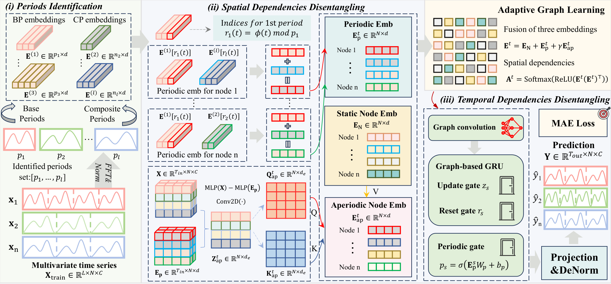
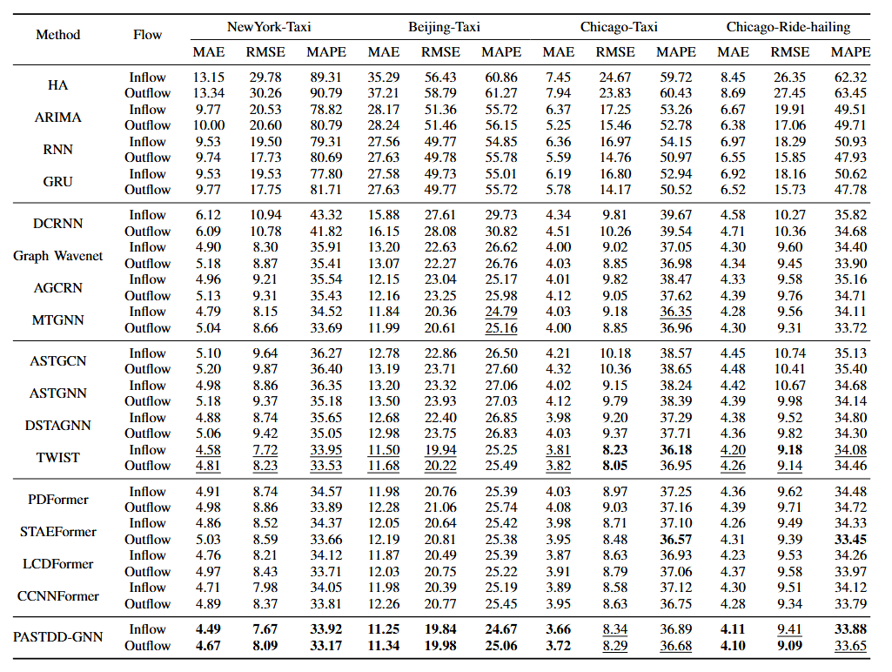

# PASTDD: Periodic-Aperiodic Spatial-Temporal Dependency Disentangling for Traffic Forecasting

Official PyTorch implementation of our **ICDM'26** paper: *"PASTDD: Periodic-Aperiodic Spatial-Temporal Dependency Disentangling for Traffic Forecasting"*.

> Traffic flow at a region is driven by two very different forces. One is **periodic**: commuting rhythms, business hours and weekly routines repeat at region-specific cycles. The other is **aperiodic**: events, weather and demand shifts that break the routine. Most spatial-temporal GNNs entangle the two inside a single hidden state and a single static adjacency matrix, so the stable rhythm and the transient deviation compete for the same capacity. PASTDD disentangles them explicitly. It first discovers each region's **own** dominant cycles with a node-level FFT, encodes them with **hierarchical periodic embeddings** that share parameters across harmonically-related periods, and then obtains the aperiodic component as the **residual** after subtracting the periodic signal from the raw input. The two streams play different roles: the periodic embedding gates the recurrent memory and shifts the node embedding, while the aperiodic residual drives an attention module that produces a *dynamic*, input-conditioned node embedding. Together they form a batch-specific adaptive graph, which a graph-based GRU consumes for multi-step forecasting.

## 🧩 Model Overview



> An overview of the PASTDD framework. First, a node-level FFT discovers each region's own Top-K periods offline. Hierarchical periodic embeddings then encode the per-node phase signals, where harmonically-related periods share an intra-cycle phase table. The input signal is next disentangled into a periodic stream and an aperiodic residual, and the aperiodic stream builds a dynamic, input-conditioned node embedding. Finally, the fused static / periodic / aperiodic node embeddings condition an adaptive graph, which a graph-based GRU consumes for multi-step forecasting.

## 📚 Table of Contents

```text
data      --> Raw datasets, ready to use. No download or preprocessing needed.

lib       --> Data loading, FFT-based period discovery, normalization, metrics and logging.

model/PASTDDGNN.py    --> The implementation of PASTDD.

model/Run.py          --> Training and testing entry point.

pre-trained  --> Released checkpoints for every dataset and flow type.

experiments  --> Auto-created run directory: logs, best model and predictions.

config_file/${DATASET}_PASTDDGNN.conf    --> Training configs.
```

Replace `${DATASET}` with one of `NYCTaxi`, `BJTaxi`, `CCGTaxi`, or `CCGRide`, and `${FLOW}` with `inflow` or `outflow`.

## 💿 Requirements

```bash
# Install Python
conda create -n pastdd python=3.8
conda activate pastdd
# Install PyTorch (CUDA 12.1 example)
pip install torch==2.4.0 --index-url https://download.pytorch.org/whl/cu121
# Install other dependencies
pip install -r requirements.txt
```

| Package | Version |
|---|---|
| python | 3.8 |
| torch | 2.4.0 |
| numpy | 1.24.1 |
| pandas | 2.0.3 |

A CUDA GPU is recommended. `BJTaxi` (1024 nodes) is the heaviest configuration; the smaller Chicago datasets (77 nodes) train comfortably on a single mid-range GPU.

## 📦 Data Preparation

**No download is required** — all four datasets are shipped in [data/](data/) and are used as-is.

### Supported Datasets

| Dataset | City / Source | Nodes | Interval | Time Span | Steps |
|---|---|---|---|---|---|
| `NYCTaxi` | New York City taxi | 266 | 30 min | 2016-04-01 → 2016-06-30 | 4,368 |
| `BJTaxi` | Beijing taxi | 1024 | 30 min | 2013-07-01 → 2013-10-29 | 4,848 |
| `CCGTaxi` | Chicago taxi | 77 | 15 min | 2022-01-01 → 2022-03-31 | 8,640 |
| `CCGRide` | Chicago ride-hailing | 77 | 15 min | 2023-01-01 → 2023-12-31 | 35,040 |

Each dataset provides two flow types, `inflow.csv` and `outflow.csv`, trained and evaluated independently.

### Data Format

```text
time,0,1,2,...,N-1
2016-04-01 00:00:00,88,73,22,...
2016-04-01 00:30:00,173,138,30,...
```

- **First column** `time`: timestamp string.
- **Remaining columns**: one column per spatial node / region.
- The loader drops the `time` column and attaches a **global step index** (`0, 1, 2, ...`) as an extra feature channel, so the tensor fed to the model is `[T, N, 2]` = `(flow, step_id)`. Periods are therefore expressed in *time steps*, and the phase stays continuous across the train / val / test split.

## 🎯 Training

The dataset, flow type, mode and device are set as constants at the top of [model/Run.py:19-24](model/Run.py#L19-L24):

```python
MODE    = 'train'      # 'train' or 'test'
DEBUG   = 'False'
DATASET = 'CCGRide'    # NYCTaxi | BJTaxi | CCGTaxi | CCGRide
DEVICE  = 'cuda:0'
MODEL   = 'PASTDDGNN'
FLOW    = 'outflow'    # inflow | outflow
```

Edit `DATASET` / `FLOW` to switch experiment, then:

```bash
cd model
python Run.py --mode train
```

Each run creates `experiments/${DATASET}/${FLOW}/PASTDDGNN/${TIMESTAMP}/` containing:

```text
best_model.pth          # best checkpoint by validation loss
PASTDDGNN.log           # full training log
${DATASET}_true.npy     # ground truth on the test set
${DATASET}_pred.npy     # predictions on the test set
```

Training uses MAE loss on the de-normalized scale (`real_value = True`), Adam, and early stopping on validation loss with a patience of 15 epochs.

## 🧪 Testing with Pre-trained Weights

Checkpoints for all 4 datasets × 2 flows are released under [pre-trained/](pre-trained/). Set `DATASET` / `FLOW` in `Run.py` to match the checkpoint you want, then:

```bash
cd model
python Run.py --mode test
```

This loads `../pre-trained/${DATASET}/${FLOW}/best_model.pth`, so the command must be run from inside `model/`.

## ⚙️ Configuration

All hyper-parameters live in `config_file/${DATASET}_PASTDDGNN.conf`.

| Section | Key | Meaning | NYCTaxi | BJTaxi | CCGTaxi | CCGRide |
|---|---|---|---|---|---|---|
| `data` | `num_nodes` | number of regions | 266 | 1024 | 77 | 77 |
| | `lag` / `horizon` | input / output window (steps) | 4 / 4 | 4 / 4 | 4 / 4 | 4 / 4 |
| | `val_ratio` / `test_ratio` | chronological split | 0.2 / 0.2 | 0.2 / 0.2 | 0.2 / 0.2 | 0.2 / 0.2 |
| | `normalizer` | column-wise z-score fitted on train only | `std` | `std` | `std` | `std` |
| `model` | `k` | Top-K periods discovered per node | 3 | 2 | 3 | 2 |
| | `embed_dim` | node / period embedding size | 15 | 20 | 20 | 20 |
| | `embed_d_model` | disentangling MLP width | 32 | 32 | 32 | 32 |
| | `rnn_units` | GBGRU hidden size | 64 | 64 | 64 | 64 |
| | `num_layers` | stacked GBGRU layers | 2 | 2 | 2 | 2 |
| | `cheb_order` | graph conv support order | 2 | 2 | 2 | 2 |
| | `lamb` | weight λ of the aperiodic node embedding | 0.05 | 0.05 | 0.05 | 0.05 |
| | `weight_decay` | L2 regularization | 1e-4 | 1e-3 | 5e-4 | 3e-4 |
| `train` | `batch_size` | | 32 | 32 | 64 | 64 |
| | `lr_init` | Adam learning rate | 2e-3 | 1e-3 | 1e-3 | 2e-3 |
| | `epochs` / `early_stop_patience` | | 200 / 15 | 200 / 15 | 200 / 15 | 200 / 15 |
| | `seed` | | 6 | 42 | 6 | 6 |

With `lag = horizon = 4`, the task is: **2 hours in → 2 hours out** for the 30-minute datasets (`NYCTaxi`, `BJTaxi`), and **1 hour in → 1 hour out** for the 15-minute datasets (`CCGTaxi`, `CCGRide`).

`lamb` is the single knob controlling how strongly the aperiodic stream perturbs the graph: `E = E_static + Z_periodic + λ · E_aperiodic`. Setting `lamb = 0` switches the aperiodic branch off entirely, which makes it a convenient one-line ablation.

## 📈 Experiment Results



